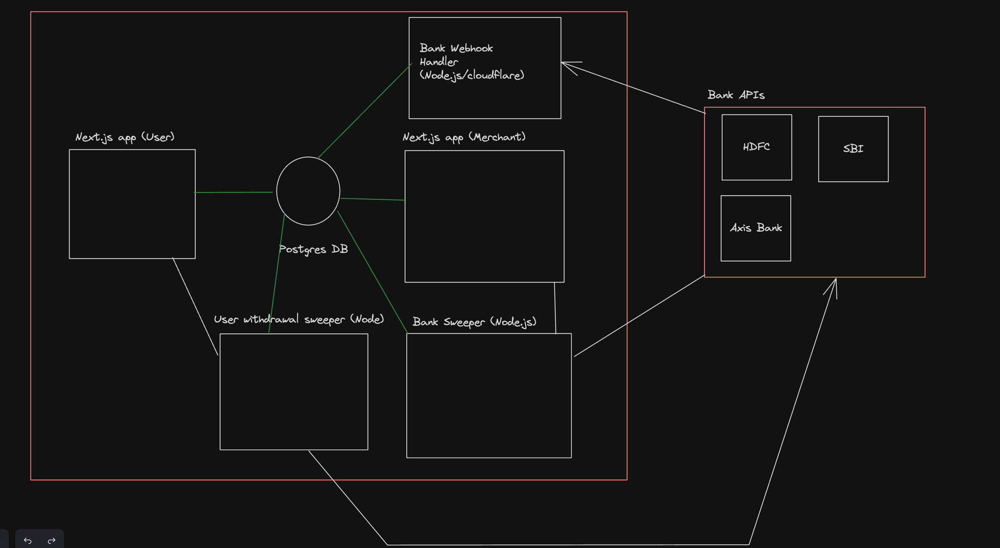
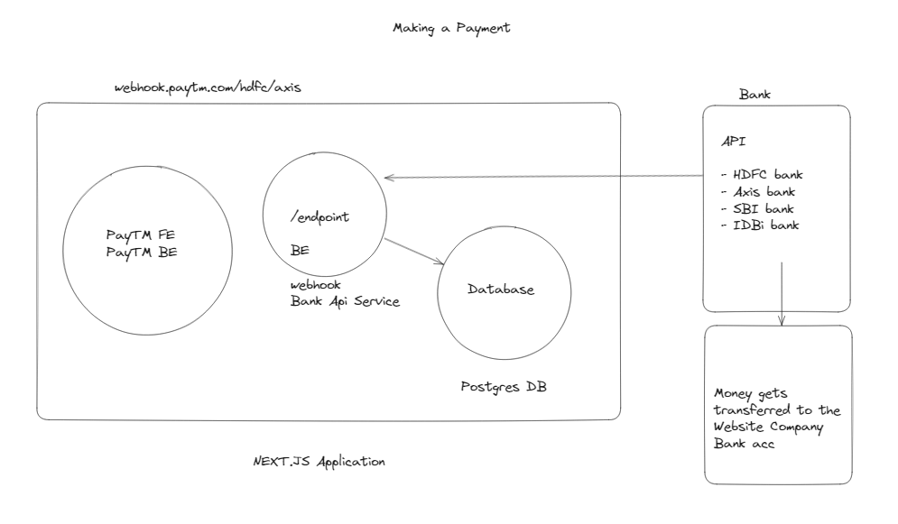
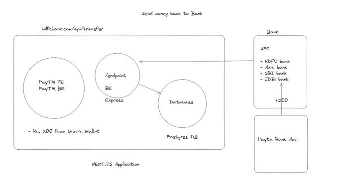
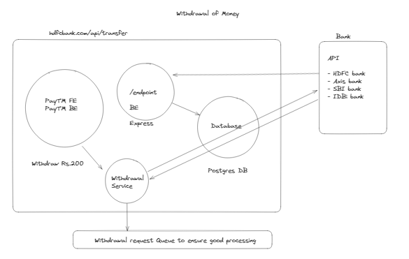

# Points

- Where to start - Feature planning
- Design UI/UX

  - UX - First principles/Copy the biggest website out there
  - UI - Designer. Today there are tools but havent found any good one

- High level Design

  - Auth provider
  - Database
  - Backend Stack
  - Frontend stack
  - Modules you’ll have (common/ui/backend)
  - Cloud to deploy to

- LLD

  - Schema
  - Route signatures
  - Frontend Components - debatable
  - 

- ER Diagrams -

  - We can build these today, but usually not needed unless you’re a very visual person

- How to think about features

  - Usually come from product
  - If you’re a founder, then just whatever u think is right

- How much complexity is needed
  - Depends on the size of the company. For a startup, whatever helps you move fast w/o tech debt. For a company there are a lot of layers of review to go through

# Hot Paths

- Send money to someone
- Withdraw balance of merchant
- Withdraw balance of user back to bank
- Webhooks from banks to transfer in money

# Techstack

- Frontend and Backend - Next.js (or Backend)
- Express - Auxilary backends
- Turborepo
- Postgres Database
- Prisma ORM
- Tailwind

# Architecture

- Making a Payment: 
- Send Money back: 
- Withdrawal of Money: 

# Feature Planning

- User login

  - Auth (In this case, probably email/phone)
  - On ramp from bank, off ramp to bank
  - Support transfers via phone number/name
  - Support scanning a QR code for transferring to merchants

- Merchant Login

  - Login with google
  - Generate a QR Code for acceptance
  - Merchants get an alert/notification on payment
  - Merchant gets money offramped to bank every 2 days

- Todo
